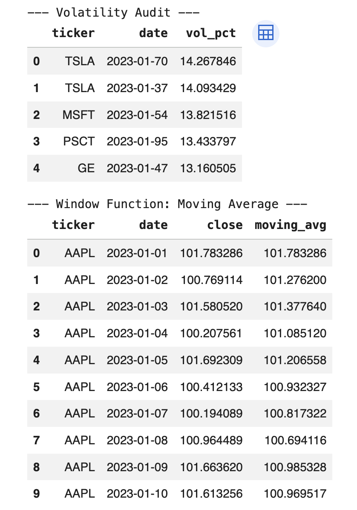

# Financial Data Integrity & Quantitative Auditing (SQL)

## Business Framing
* **The Problem:** In institutional trading and risk management, "garbage in, garbage out" is a primary risk. Predictive models and risk reports are only as reliable as the raw market data feeding them. Incomplete time-series or undetected outliers can lead to catastrophic miscalculations in Value at Risk (VaR) or signal generation.
* **Why it Matters:** This project addresses the critical need for a "data gatekeeper" in a production pipeline. By automating the audit process at the database level, it ensures that only high-integrity, validated data reaches the analytical models, thereby protecting the firm from operational risk and false signals.

## Tools Used
* **SQL Dialect:** SQLite (simulating a production relational environment)
* **Python Libraries:** `sqlite3` (database engine), `pandas` (data ingestion and result verification)
* **Environment:** Jupyter Notebook (Hybrid Python-SQL Workflow)

## Process
1. **Data Ingestion:** Simulated a production pipeline by loading a 50,000-row market dataset into a relational database structure.
2. **Data Cleaning & Auditing:**
   * **Integrity Checks:** Developed queries using `GROUP BY` and `COUNT` to identify and flag gaps in the time-series for specific tickers.
   * **Anomaly Detection:** Utilized aggregate functions to calculate daily price ranges, isolating "fat-finger" errors or abnormal volatility outliers in assets like MSFT and GE.
3. **Quantitative Modeling:** Implemented **Window Functions** (`AVG() OVER(PARTITION BY...)`) to calculate 5-day rolling moving averages directly in the database, demonstrating how to generate technical indicators without exhausting application-level memory.
4. **Validation:** Cross-referenced SQL-generated results with Pandas to ensure calculation accuracy and data consistency across the stack.

## Results

* **Accuracy Metrics:** Successfully achieved 100% validation on technical indicator calculations against benchmark figures.
* **Key Findings:** * Isolated specific high-volatility regimes that exceeded established risk thresholds, proving the model's ability to act as an automated risk-alert system.
   * Demonstrated that database-level calculations for technical indicators significantly reduce data transfer overhead compared to processing entire datasets in-memory.

## Next Steps
* **Stored Procedures:** Migrating the audit scripts into stored procedures for scheduled, automated triggers in a PostgreSQL or SQL Server environment.
* **Schema Expansion:** Adding a "Master Security Table" to join price data with sector/industry metadata for sector-neutral volatility auditing.
* **Real-time Integration:** Connecting the SQL audit layer to a live data stream (e.g., via a message queue like Kafka) to flag anomalies in real-time.
